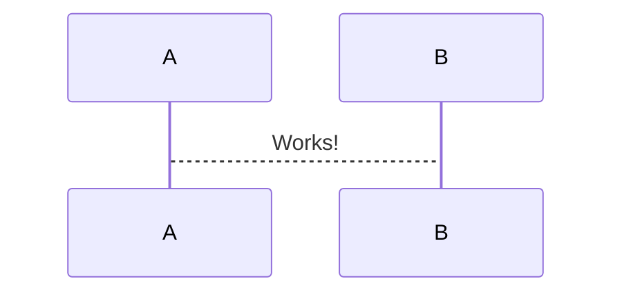

# Hi!

[APMC](https://youtu.be/RRycd1lvnMI)  
[Overleaf](https://www.overleaf.com/project/6418bf7b33c98170407afe73)  
[Typst](https://typst.app/project/piJ-oD3L4HV8uz_zLVd8Yi)  
[Flowcharts (source)](https://github.com/bradmartin333/bradmartin333.github.io/blob/e300bc64dabff81ccc040cc2c567d7871cb0356f/other/journey.html)  
[Flowcharts (render)](https://bradmartin333.github.io/other/journey.html)  
[Bard](https://bard.google.com/)
[Quadratic](https://app.quadratichq.com/)

